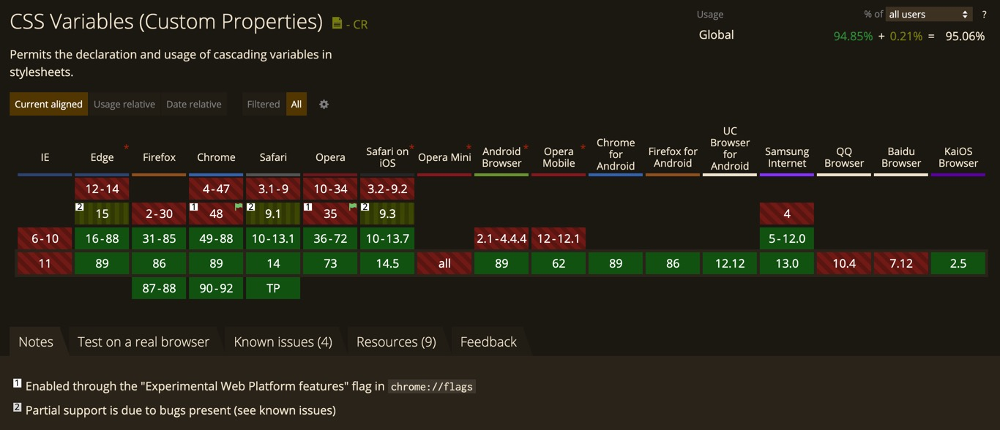
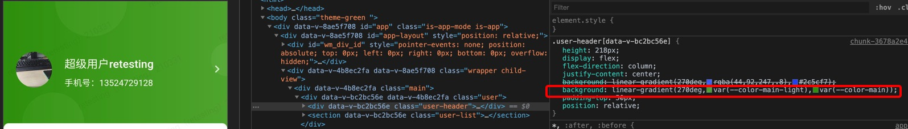
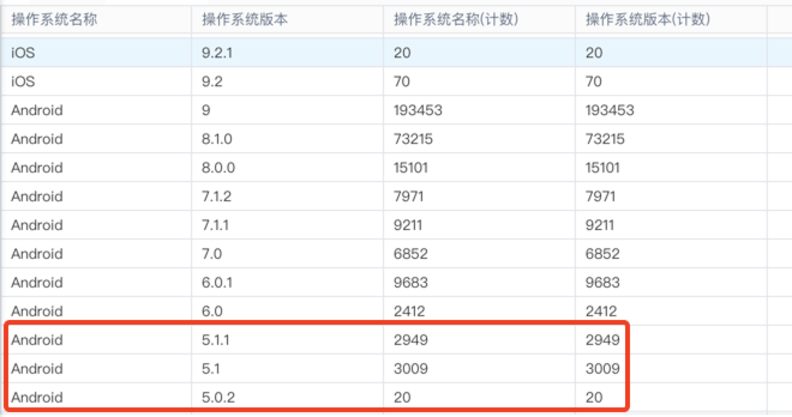
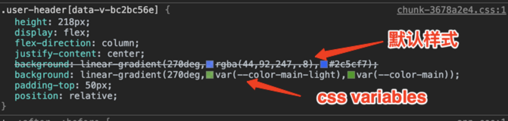

## 背景

我们作为 Saas 服务提供商，面对的首要问题是如何优雅的解决用户的个性化需求，即 **在尽量低的维护成本下满足用户的个性化需求** 。所以针对不同用户有着不同主题的需求，我们也要基于此去寻求解决方案。动态换肤的方案应运而生

所谓动态换肤，就是 **在代码发布之后，用户可以通过自己的行为操作换肤**。那么我们如何去实现它呢？

## 方案一：多套主题样式

这也是最常想到的方案，大致思路如下：

1. 准备主题，有两种方式：1）所有主题写在一个样式文件，利用不同顶级类名当作命名空间来隔离各个主题样式。2）把不同主题样式写在不同的样式文件里面
2. 开发阶段：开发具体页面组件的时候，涉及到主题的样式全部用`类名`来控制
3. 切换主题：对应的也有两种方式：1）通过 js 给 body 加不同的顶级类名，达到切换主题的目的。2）通过获取 link 标签动态更改它的`href`属性。后者相比前者性能相对好一点儿，不用全量引入主题。

这种方案的优缺点：

优：

> - 兼容性很强
> - 性能方面表现良好

劣：

> - 浪费空间，不管是方式一还是方式二，都需要打包多套主题样式
> - 开发不友好，需要入侵 html，使用不同的类名
> - 主题样式需要收敛到指定 class 下面
> - 重构迁移工作量太大

## 方案二：JS 动态替换

为了弥补方案一的缺陷，所以我们有了方案二。想象一下，每一个页面在渲染完成之后，它的样式肯定是固定下来了，无非就是在两个地方：1）`style`标签内。 2）`link`标签引入（行内样式不在考虑范围之内）。前者我们可以直接通过`document.head.[style].innerText`获取样式，后者由于是静态文件，我们可以通过 http 去获取。获取到样式之后给它来个全局替换，然后重新写入样式。那么这种方式可行吗？

答案当然是肯定的，如下：

1. 首先我们需要一个获取全局样式的方法，`getAllStyles`

```js
function getAllStyles() {
  getFile('//xxx.com/index.html') // 获取当前页面html
    .then(({ data }) => {
      // 正则匹配拿到所有link引入的css文件路径
      return data.match(/href="[\w-]+\.css"/g).map(str => str.split('"')[1])
    })
    .then(styleFiles => {
      return Promise.all(
        styleFiles.map(file => {
          return getFile(`//xxx.com/${file}`)
        })
      )
    })
    .then(files => {
      let styleStr = ''
      files.forEach(file => {
        // 将所有样式模版拼在一起
        styleStr += getStyleTemplate(file.data)
      })
      return styleStr
    })
}
```

2. 实现 `getFile`

```js
// 实现一个ajax请求，可用相关库代替
function getFile(url, isBlob = false) {
  return new Promise((resolve, reject) => {
    const client = new XMLHttpRequest()
    client.responseType = isBlob ? 'blob' : ''
    client.onreadystatechange = () => {
      if (client.readyState !== 4) {
        return
      }
      if (client.status === 200) {
        const urlArr = client.responseURL.split('/')
        resolve({
          data: client.response,
          url: urlArr[urlArr.length - 1],
        })
      } else {
        reject(new Error(client.statusText))
      }
    }
    client.open('GET', url)
    client.send()
  })
}
```

3. 实现获取样式模版方法 `getStyleTemplate`

```js
function getStyleTemplate(data) {
  // 主题map
  const colorMap = {
    '#3a8ee6': 'shade-1',
    '#409eff': 'primary',
    '#53a8ff': 'light-1',
    '#66b1ff': 'light-2',
    '#79bbff': 'light-3',
  }

  Object.keys(colorMap).forEach(key => {
    const value = colorMap[key]
    data = data.replace(new RegExp(key, 'ig'), value)
  })
  return data
}
```

4. 写入新的主题样式， `writeNewStyle`

```js
async writeNewStyle () {
  let cssText = await getAllStyles();
  // primary为主题色
  let primary = '#f00'
  let colors = generateColors(primary)
  // 全局替换，把模板关键词换成具体颜色值
  Object.keys(colors).forEach(key => {
    cssText = cssText.replace(new RegExp('(:|\\s+)' + key, 'g'), '$1' + colors[key])
  })
  // originalStylesheetCount是初次渲染时缓存的style标签总数。这里判断是为了避免重复生成style标签
  if (originalStylesheetCount === document.styleSheets.length) {
    const style = document.createElement('style')
    style.innerText = cssText
    document.head.appendChild(style)
  } else {
    document.head.lastChild.innerText = cssText
  }
}
```

5. 生成主题的方法 `generateColors`

```js
import color from 'css-color-function'
const formula = {
  'shade-1': 'color(primary shade(10%))',
  'light-1': 'color(primary tint(10%))',
  'light-2': 'color(primary tint(20%))',
  'light-3': 'color(primary tint(30%))',
}

const generateColors = primary => {
  let colors = {}

  Object.keys(formula).forEach(key => {
    const value = formula[key].replace(/primary/g, primary)
    // 通过color插件生成具体色值
    colors[key] = color.convert(value)
  })
  return colors
}
```

这种方案的优缺点：

优：

> - 兼容性很强
> - 没有多套样式，节约空间
> - 不需要收敛样式
> - 重构迁移成本相对较低
> - 对具体的业务组件零入侵

劣：

> - 典型的以时间换空间，因为使用了大量的 js 操作，并且对超长字符串进行多次替换。性能相对较差（不过执行时间也就几十毫秒）
> - 渲染的时候实际上是样式覆盖，也就是说原来的主题样式并没有去掉，两套主题同时在运行
> - 我们目前的单页应用是懒加载，新的样式文件需要重新发起多个 ajax 请求
> - 懒加载，也会导致 **每次进入不同页面都得执行样式替换**, 相当于每个页面组件都多了个副作用

## 方案 3: CSS Variables

方案二的引入成本很低，但是有过多的 js 入侵，看起来好像也有点儿别扭，毕竟是 js 干了 css 的活。所以我们尝试需求新的方案，时代不断在进步，技术迭代这么快，那么有没有新的技术供我们使用呢？答案就是 [CSS Variables](https://developer.mozilla.org/en-US/docs/Web/CSS/Using_CSS_custom_properties), 这个概念由谷歌的工程师 Tab Atkins Jr 提出，并在 2012 年 4 月提交了第一个版本，经过多次迭代，在 2015 年 12 月成为 W3C 的候选提案。

之前之所以很少用得上，是因为兼容性问题比较多。但随着终端的更新，特别是移动端，我们逐渐可以对一些新技术尝鲜了。
下图为 CSS Variables 的兼容性：



可以看到，整体支持率是 95.06%，它在移动端支持率还是很不错的：安卓系统 4.4.4 以上，Ios9.3 以上。

接下来我们说下具体方案

1. 主题定义，以下就是智慧客服 app 的所有主题样式，每个主题色只有一个色值，加上不同透明度就是一个色系。是不是很清爽？

```css
/* 主题色, 利用CSS Variables属性实现动态换肤, 风格类名以theme-开头 */
body {
  /* --* 为变量声明，并且声明支持类的‘作用域‘，通过不同的类定义不同的变量*/
  --color-main: rgba(44, 92, 247, 1);
  --color-main-light: rgba(44, 92, 247, 0.8);
  --color-main-light-bg: rgba(44, 92, 247, 0.1);
  --color-main-shadow: rgba(44, 92, 247, 0.27);

  &.theme-green {
    --color-main: rgb(54, 156, 12);
    --color-main-light: rgba(54, 156, 12, 0.8);
    --color-main-light-bg: rgba(54, 156, 12, 0.1);
    --color-main-shadow: rgba(54, 156, 12, 0.27);
  }
  &.theme-gold {
    --color-main: rgb(205, 127, 50);
    --color-main-light: rgba(205, 127, 50, 0.8);
    --color-main-light-bg: rgba(205, 127, 50, 0.1);
    --color-main-shadow: rgba(205, 127, 50, 0.27);
  }
}
```

2. 开发时业务组件引入变量的操作也很简单

```css
/* 通过var(--*)使用变量 */
.xxx {
  background: linear-gradient(
    270deg,
    var(--color-main) 0%,
    var(--color-main-light) 100%
  );
  color: var(--color-main-light-bg);
  border: 1px solid var(--color-main-shadow);
}
```

而且由于这种变量声明和使用的方式是 css 支持的，所以它不像 sass 和 less 的那种变量需要编译成 css，浏览器的渲染后的样式值就长这样：



3. 动态切换主题

```js
const changeTheme = () => {
  return getThemeType().then(type => {
    const cn = type ? 'theme-' + type : ''
    // 替换原有主题className
    let cns = document.body.className
    if (cns.indexOf('theme-') > -1) {
      cns = cns.replace(/theme\-\S*\s?/, cn + ' ')
    } else {
      cns = cns + ' ' + cn
    }
    document.body.className = cns
  })
}
```

前面提到，我们智慧客服 app 使用的动态换肤用的就是这套方案，但是实践过程中还是遇到了问题：虽然官方给的兼容地图提到 CSS Variables 的移动端兼容性可以覆盖到 4.4.4 版本以上，但是在部分安卓 5.0、5.1 机型上是不支持的，比如 oppo, 华为部分老机型目前还是 5.x 的系统。

打开天眼，可以看到还是由少部分客户在使用这些老系统：



所以我们也需要保证这些机型的正常运行，如果不做处理，那么所有使用到 CSS Variables 的地方都会变成无色，会严重影响使用。但也因为这样的机型使用率不高，所以我们采取了一个折中的方案，固定注入默认主题，如果判断不支持 CSS Variables，那么就自动使用默认主题色。具体操作如下：

1. 引入插件 `postcss-css-variables`

`npm install postcss-css-variables -D`

2. 配置 postcss.config.js

```js
module.exports = ({ env }) => {
  let plugins = {}
  if (env === 'production') {
    plugins = {
      'postcss-css-variables': {
        preserve: true,
        preserveInjectedVariables: false,
        variables: {
          // 注入默认主题，可以兼容旧版本浏览器
          '--color-main': 'rgba(44, 92, 247, 1)',
          '--color-main-light': 'rgba(44, 92, 247, 0.8)',
          '--color-main-light-bg': 'rgba(44, 92, 247, 0.1)',
          ' --color-main-shadow': 'rgba(44, 92, 247,0.27)',
        },
      },
    }
  }
  return {
    plugins,
  }
}
```

这个配置会在打包的时候，在每一行含有 `var(--*)` 的 css 样式之前加一行默认样式，如图：



这样按照浏览器的机制，如果不支持 CSS Variables 的话，那么上面那行默认样式就会默认生效

这种方案的优缺点：

优：

> - 性能优秀，除了切换类名，其他地方纯 css 操作
> - 重构迁移成本相对较低，写好主题，只需全局替换对应的样式值即可
> - 不需要考虑懒加载的问题

劣：

> - 需要收敛样式
> - 部分老机型不兼容

## 总结

可以看到，以上三种方式各有优劣，很难找到一种完美的方案，具体选择哪一种，需要从实际的业务场景去评估。比如移动端我们对性能有要求，**而且现在手机更新快，老版本的系统会越来越少，我们可以果断考虑引入一些新技术来提效**。像之前比较困扰我们的如何撑满手机屏幕高度的问题（用绝对定位或者 flex 都不完美），但是用 CSS3 的 vh + calc 就很容易实现，它俩兼容性在移动端目前基本上全线支持。

再比如，如果 PC 端也有动态换肤的需求，那我们肯定不能用方案三，因为 CSS Variables 压根不支持 IE，我们可以使用方案一或者方案二。特别对我们 PC 后台的 php 后端渲染 项目，在考虑维护和开发成本的情况下，我们可以果断选择方案二去实现动态换肤
