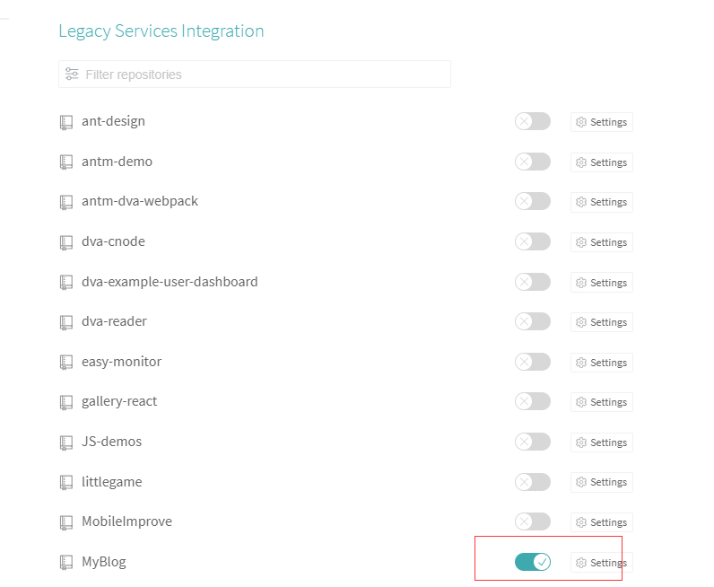

最近，在一次日常舔大佬的途中，发现某位大佬([Dan Abramov](https://mobile.twitter.com/dan_abramov))的 Twitter 有个文章链接，果断点了进去。进去之后，眼前一亮，这是他的[个人网页](https://overreacted.io/)，页面极其简洁，操作流畅。作为一名合格的舔狗，肯定要果断抄袭。。。啊不。。。借鉴一下啦[戳这里](http://wuhub.top/)。顺便说下，里面文章干货很多，都是大佬创造 React 的心理历程，后续我准备一一翻译过来，嘿嘿。

---

原来大佬也是引用的一个开源库[gatsby](https://github.com/gatsbyjs/gatsby-starter-blog)。这是一个 React 静态网站构建器。

使用它，你的网站可以同时享有静态网站和 React 的优点。通过加载插件，可以做到支持多种数据资源，比如 Markdown，WordPress 的文章等。支持自动代码分割，图片优化，预加载，懒加载等等。关键是他没有后端交互，构建个人网站你甚至不需要买服务器和域名，直接部署在 github pages 上即可。

生成网站只需要两步：

1. `npm install -g gatsby-cli`
2. `gatsby new my-blazing-fast-site`

然后在项目根目录下执行`gatsby develop`，访问[http://localhost:8000](http://localhost:8000)。

到这里，你的第一个个人网站就运行起来了，是不是很简单？然后你只需在`src/pages/`目录下面添加 Markdown 格式的文章即可。

接下来我们要做的就是将网站发布到线上，让其他人看到。两种方法：

1. 发布到 github pages 。
2. 发布到自己的服务器上面。

这一步也很简单。

第一种方式，项目打包后执行`git subtree push --prefix=dist origin gh-pages`。把项目推到 gh-pages 分支，然后访问`XXX.github.io/项目名/`。

第二种方式，用`scp`或者`rsync`工具把项目推到自己的主机，然后配置`nginx`：

```sh
server {
  ...
  location / {
              root /home/blog/MyBlog/public; # 项目路径
              index index.html;
  }
  ...
}
```

然后访问主机 ip 即可。

接下来我们来实现集成部署，让我们只需通过`git push`这一操作，就能实现网页的更新。

这里我们要用到[travis](https://travis-ci.com/getting_started)，用过 jenkins 的朋友对这个应该也不会陌生。

第一步，关联自己的 github 项目，[戳这里](https://www.travis-ci.org/account/repositories)：



第二步（部署到自己的主机），我们在项目的根目录下新建一个 travis 配置文件`.travis.yaml`：

```sh
language: node_js #运行环境
node_js:
  - 8.9.0
cache:
  directories: #缓存目录，让travis服务器缓存node_modules 增加打包速度
    - node_modules
before_install: #这一步很重要，将本地私钥传到travis服务器。它可以让travis服务器免密ssh到你自己的主机。
  - openssl aes-256-cbc -K $encrypted_2a36be4ef7a3_key -iv $encrypted_2a36be4ef7a3_iv
    -in id_rsa.enc -out ~/.ssh/id_rsa -d
  - chmod 600 ~/.ssh/id_rsa
after_success:
  - ssh root@xxx.xxx.xxx.xxx '/home/blog/build-blog.sh'
branches: #关联github的部署分支
  only:
    - deploy #只有该分支发生变化时，才会触发自动部署
addons:
  ssh_known_hosts: xxx.xxx.xxx.xxx

```

`before_install`的内容是通过命令行自动添加的，需要经过以下步骤：

1. 首先在本地生成 ssh 密钥对：`ssh-keygen -t rsa`
2. 将公钥复制到自己的远程主机上：`ssh-copy-id -i ~/.ssh/id_rsa.pub root@123.123.123.123`
3. 将私钥加密传输到 travis，解决 ssh 登录的加密问题。

```sh
# 安装travis
sudo gem install travis
# 使用github账号登陆travis
travis login --auto
# 切换目录到项目根目录，执行
travis encrypt-file ~/.ssh/id_rsa --add # 这里就生成了 before_install的内容
```

另外，在使用 ssh 登陆的时候会确认主机信息，travis-ci 自动化运行无法进行交互操作，所以在.travis.yml 中添加以下内容跳过确认：

```
addons:
  ssh_known_hosts: xxx.xxx.xxx.xxx
```

接下来我们就可以通过 ssh 登陆到远程主机之后，做一系列操作，这里我们直接写了个 sh 脚本`/home/blog/build-blog.sh`：

```sh
cd /home/blog/MyBlog
git pull
npm install
npm run build
echo "Build success."
```

以上，我们就完成了持续集成的配置操作。接下了只需将我们的项目 merge 到相应的 github 分支，就可以测试我们了自动部署了。

最后，如果你没有自己的服务器，那也可以用 travis + ghpages 的方式实现。配置`.travis.yaml`，像这样:

```sh
deploy:
  provider: pages
  skip_cleanup: true
  github_token: $GITHUB_TOKEN # Set in travis-ci.org dashboard
  on:
    branch: master
```

这里就不一一赘述了。

本项目地址：[MyBlog](https://github.com/wuyafeiJS/MyBlog)
