**客服组 app 风险管控的学习坊模块需要这样的功能。目的是为了客户的信息安全考虑。防止截图外泄。有了水印，第一可以起到警示的作用，比如用户看到这种水印，就自然觉得这是敏感信息。第二可以当作泄露证据，因为水印信息一般就是使用者的信息。
我们这里的水印并不是大家印象中的图片水印。它是打在页面上的。可想而知，图片是死的，打一次水印就好。但是页面是动态的。怎么做呢？**

---

### 方案一：背景水印

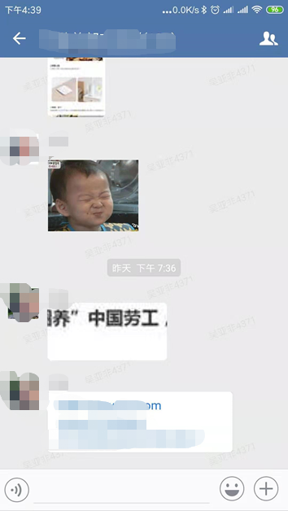

这个也是最普遍的水印方式。一般有两种实现方式：1.给底层元素设置背景图片（比如，用多个小图平铺，`background` 设置 `repeat`，或者直接仍一整张图）。2.直接用绝对定位的方式在底层 dom 平铺 dom 元素。那么第一种方式如果要变成动态的，就得用 `canvas` 先画好，然后再通过它提供给的 API -> `toDataURL` 将画布转换成 `base64` 的图片即可。

但是种方案有个问题，就是不像聊天框，界面比较简单，但是前端页面是动态多变的，有些页面甚至可以完全遮挡住顶层 dom。所以这种方案显然是行不通的。

---

### 方案二：遮罩水印

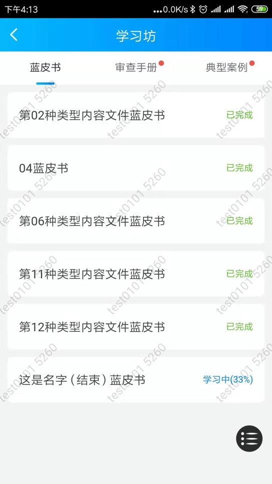

顾名思义，就是把水印盖在整个页面上，如图。这样就能保证水印能够完全保留。下面我们说下实现方式：

- 用 dom 实现
- 获取水印容器的宽高，根据水印的尺寸计算水印显示的行数和列数
- 两个循环，分别循环行和列，创建水印 Dom

为什么用 dom 呢？第一，简单，而且能满足我们的需求。第二，相对于 canvas 它的定制性更高一点，因为一般我们如果用 canvas 实现，最好的方式是用 canvas 画一个最小单位的水印，然后转成图片进行平铺，它的每一个水印都是一样的，像上图这种，用 canvas 可以，但是如果我们要多次定制水印的显示效果，那就比较复杂了。

这里根据水印的尺寸计算行数列数。如果我们的水印是带有倾斜角度的，就需要用正弦或者余弦函数去计算水印 dom 的具体宽高。但是这种方案会有一个问题，就是既然水印盖在页面上，那就势必为会影响原本页面的 dom 操作。比如页面滑动点击拖拽等，因为我们的操作统一会被这层水印给接收。所以，我们得想办法在我们做各类 dom 事件操作的时候直接忽略掉这层 dom。

这里我们用到了 css 提供的一个属性：[pointer-events
](https://developer.mozilla.org/zh-CN/docs/Web/CSS/pointer-events)

它能指定在什么情况下 (如果有) 某个特定的图形元素可以成为鼠标事件的  target。它的产生主要是为 svg 服务的。以下是它的的所有属性值：

```css
/* Keyword values */
pointer-events: auto;
pointer-events: none;
pointer-events: visiblePainted; /* SVG only */
pointer-events: visibleFill; /* SVG only */
pointer-events: visibleStroke; /* SVG only */
pointer-events: visible; /* SVG only */
pointer-events: painted; /* SVG only */
pointer-events: fill; /* SVG only */
pointer-events: stroke; /* SVG only */
pointer-events: all; /* SVG only */

/* Global values */
pointer-events: inherit;
pointer-events: initial;
pointer-events: unset;
```

可以看到，它有 11 种属性，有 9 种仅限于`svg`使用。所以我们能用的就两个： `auto`和`none`。

如果值为`none`，元素永远不会成为鼠标事件的 target。但是，当其后代元素的 pointer-events 属性指定其他值时，鼠标事件可以指向后代元素，在这种情况下，鼠标事件将在捕获或冒泡阶段触发父元素的事件侦听器。

通过这个属性呢我们就可以实现我们之前的穿透水印遮罩的需求了。该属性也可用来提高滚动时的帧频。因为，当滚动时，鼠标悬停在某些元素上，则触发其上的`hover`效果，然而这些影响通常不被用户注意，并多半导致滚动出现问题。对 body 元素应用`pointer-events：none`，禁用了包括 hover 在内的鼠标事件，从而提高滚动性能。

实际上到这里我们所有需要准备的东西已经都备齐了，具体代码这里就不展示了，感兴趣的同学可以直接看[源码](https://git.mysre.cn/frontend-plugin/page-watermark)。或者拉下来感受一下。

`npm install yl-page-watermark -S`

下面我们说一下优化点。

 --> 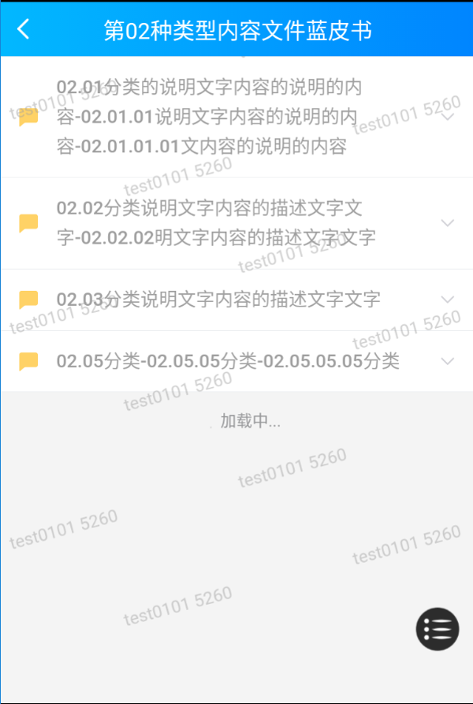

可以看到我们之前那种效果太规律了，太显眼了，所以 po 要求变成右边这种效果。所以我们要改变一下我们的水印生成方式。原先我们是两层循环，在第二层循环里面去创建水印。现在我们可以在第一层循环下面先创建一行的水印。然后判断如果是奇数行，那么就向右移动一点距离。也要注意下，如果水印有倾角，我们整个水印容器的高度也需要重新用余弦或者正弦计算一下，不然在底部会有一部分三角形的空白。

最后，`pointer-events`的兼容性如下：

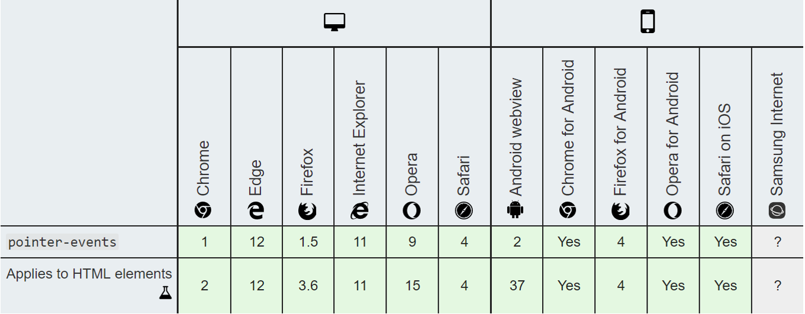

可以看到，移动端基本可以覆盖到当下主流的所有系统版本。pc 端是 ie11 以上。

页面水印的制作过程其实就这么多。是不是很简单，主要的点就是`pointer-events`这个属性。

---

前面我聊的更多的是水印的显示方案。接下来我们衍生一下。来看看当下较为主流的前端水印生成方案：

- Dom 生成，最简单，也是我们这个页面水印的实现方式。
- Canvas 或者 Svg 实现。用 background-image 平铺背景图。

这就是我们前端最常用的两种水印生成方式，但是，它们会有什么问题呢？比如，如果有人用开发者工具修改了 background-image 这个属性或者删掉了整个 dom 那水印就失效了？

这里我们可以用[Mutation Observer API](https://developer.mozilla.org/zh-CN/docs/Web/API/MutationObserver) 。他可以监听`DOM` 的任何变动，比如节点的增减、属性的变动、文本内容的变动，这个 API 都可以得到通知。

但是 MutationObserver 对于自己本身被删除，是没有办法的,那么我们可以通过监测父结点来达到要求。

```js
 monitorChange() {
    // 监听dom变化
    const MutationObserver =
      window.MutationObserver || window.WebKitMutationObserver;
    if (MutationObserver) {
      let mo = new MutationObserver(() => {
        const __wm = this.otdiv;
        // 只在__wm元素样式变动或者被删除才重新调用 loadmark, styleStr为样式字符串
        if ((__wm && __wm.getAttribute('style') !== this.styleStr) || !__wm) {
          // 避免一直触发
          mo.disconnect();
          mo = null;
          this.loadMark(this.config);
        }
      });
      // 监听父元素
      mo.observe(this.parentEle, {
        attributes: true,
        subtree: true,
        childList: true
      });
    }
  }
```

这样就解决了我们刚刚提到的问题。但是这样就安全了吗，我们还会有其他的攻击手段，比如有损压缩，涂改等。那么，针对这种攻击手段，我们有更安全的解决方案吗？

---

其实最安全的方式就是让用户不知道有水印，即让用户看不到水印，当然就不会有刻意的攻击。接下我们来聊聊盲水印。当然，这已经我们最先的需求：**起到警示作用** 背道而驰了，这里主要是帮助大家拓展一下视野，以便大家以后遇到类似的需求能够第一时间想到对应的解决方案。

所谓**盲水印**，是指人感知不到的水印，包括看不到或听不见（没错，数字盲水印也能够用于音频）。其主要应用于音像作品、数字图书等，目的是，在不破坏原始作品的情况下，实现版权的防护与追踪。

接下来，我们说一下三种不同的盲水印实现方案：

### 方案一：降低透明度，让水印近似不可见

一般我们可以把透明度设置为 0.002。但是再 ps 软件下调高对比度即可清晰看到水印。但是这种本质上来说还不是盲水印，因为只是颜色变淡了，仔细看还是能看到一点点，如下图：

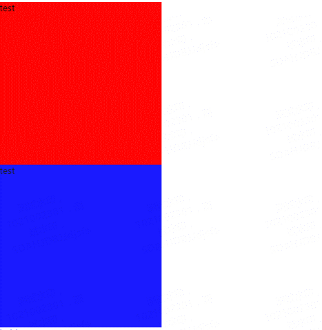 --> 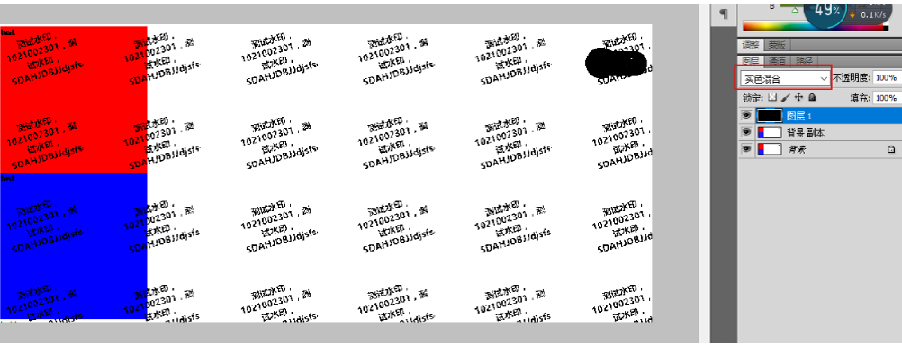

### 方案二：canvas+算法

我们知道图片的像素信息里存储着 `RGB` 的色值，R、G、B 分别为该像素的红、绿、蓝通道，每个通道的分量值范围在 0~255。这时候，对 R 分量的值+1，比如红色由(255,0,0)变为(254,0,0)，这时候人眼是完全看不出差别的。于此同时，修改 G、B 的分量值，也是我们无法察觉的。因此可以得出重要结论：RGB 分量值的小量变动，是肉眼无法分辨的，不影响对图片的识别。接下来我们说下具体的实现方式。

首先在页面加入三个 canvas 标签，分别用来放原图，合并水印后的图片以及解析后的水印图片。

```html
<canvas id="canvas" width="256" height="256"></canvas>
<canvas id="canvas2" width="256" height="256"></canvas>
<canvas id="canvas3" width="256" height="256"></canvas>
```

合成水印

```js
// canvas+算法盲水印
let ctx = document.getElementById('canvas').getContext('2d')
let ctx2 = document.getElementById('canvas2').getContext('2d')
let ctx3 = document.getElementById('canvas3').getContext('2d')

// 获取图片数据
let img = new Image()
let originalData
img.src = '/demo/assets/demo02.jpg'
img.onload = () => {
  ctx.drawImage(img, 0, 0)
  // 获取指定区域的canvas像素信息
  originalData = ctx.getImageData(0, 0, ctx.canvas.width, ctx.canvas.height)
  // 生成水印
  let textData
  ctx2.font = '30px Microsoft Yahei'
  ctx2.fillText('明源云链', 60, 130)
  textData = ctx2.getImageData(0, 0, ctx2.canvas.width, ctx2.canvas.height)
  // ctx2.putImageData(textData, 0, 0);

  // 合成图片
  originalData = mergeData(textData.data, originalData, 'R')
  // 画出合成后的图片
  ctx2.putImageData(originalData, 0, 0)
}
```

```js
const mergeData = (newData, oldData, color) => {
  let oData = oldData.data
  let bit, offset // bit是取模后的值，offset的作用是找到alpha通道值

  switch (color) {
    case 'R':
      bit = 0
      offset = 3
      break
    case 'G':
      bit = 1
      offset = 2
      break
    case 'B':
      bit = 2
      offset = 1
      break
  }

  for (let i = 0; i < oData.length; i++) {
    if (i % 4 == bit) {
      // 只处理目标通道
      if (newData[i + offset] === 0 && oData[i] % 2 === 1) {
        // 没有信息的像素，该通道最低位置0，但不要越界
        if (oData[i] === 255) {
          oData[i]--
        } else {
          oData[i]++
        }
      } else if (newData[i + offset] !== 0 && oData[i] % 2 === 0) {
        //
        oData[i]++
      }
    }
  }
  return oldData
}
```

最后我们得到了合成了水印后的图片：（左图为原图，右图为合成后）

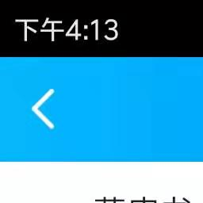 --> 

怎么解析水印呢？

```js
let img = new Image()
let originalData
img.src = '/demo/assets/marked.png'
img.onload = () => {
  ctx.drawImage(img, 0, 0)
  // 获取指定区域的canvas像素信息
  originalData = ctx.getImageData(0, 0, ctx.canvas.width, ctx.canvas.height)

  processData(originalData)
}
```

```js
const processData = originalData => {
  let data = originalData.data
  for (let i = 0; i < data.length; i++) {
    // 红色
    if (i % 4 == 0) {
      if (data[i] % 2 == 0) {
        data[i] = 0
      } else {
        data[i] = 255
      }
    } else if (i % 4 == 3) {
      // alpha通道不做处理
      continue
    } else {
      // 关闭其他分量
      data[i] = 0
    }
  }
  // 将结果绘制到画布
  ctx3.putImageData(originalData, 0, 0)
}
```

得到的水印：

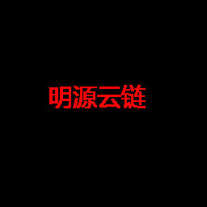

---

### 方案三：真正的盲水印，频域盲水印

前面我们讲的都是前端方案，最后我们讲一个后端方案，也是目前最优的方案。

什么事频域？我们所看到图像就是空域或者说时域（即二维的图像信号），它随着时间的变化而变化。而频域，我们可以理解它是上帝视角下的时域，它是时域的规律。每一个空域都能通过多个频率合成。频域添加水印的方法，是指通过某种变换手段（我们这里通过傅里叶变换）将图像变换到频域（小波域），在频域对图像添加水印，再通过逆变换，将图像转换为空间域。

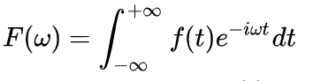

上面就是傅里叶变换公式。f(t)就是时域，当然这是针对信号的，按照我们的理解就是空域。W 就是频率，如果大家相对傅里叶变化有进一步的了解，可以[戳这里](https://zhuanlan.zhihu.com/p/19763358)。反正我们只要知道，有方法可以将空域图像转换成频域。

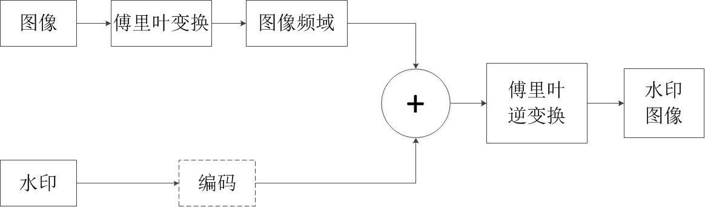

上图就是制作水印的过程
这里的编码做两件事，一个是给水印加密，二是将加密后的水印转换成水印图像频域

这里我们用到了开源库 --- OpenCV 来实现图像傅里叶变换以及最终的水印合成。
它是一个跨平台计算机视觉库，实现了图像处理和计算机视觉方面的很多通用算法。

官方支持 Python、Ruby、Go、Java 等主流后端语言和一些硬件编程语言。

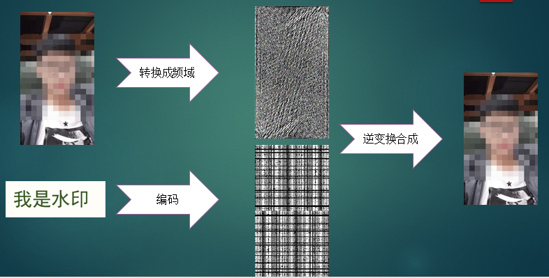

上面就是水印合成过程，拿到合成图片和原图，经过反编码可以得到下面这个水印


水印在左上角，这个看不清楚，我选的水印颜色不合适，^\_^!
这就是频域盲水印。它抗攻击性能强劲。

所谓对水印的攻击，是指破坏水印，包括涂抹，剪切，放缩，旋转，压缩，加噪，滤波等。这些频域盲水印都能够预防。

想了解更多，可以[戳这里](https://www.zhihu.com/question/50735753/answer/122593277)

### 总结

其实即使是频域水印，也有预防不了的攻击手段，比如通过拍照获取图片。但是这些已经能够抵御大部分攻击了，而且有些水印对防攻击性要求并没有那么高，所以大家完全可以根据自己需求去使用合适的水印方案。
