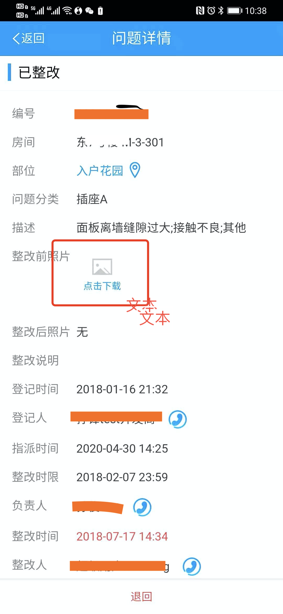
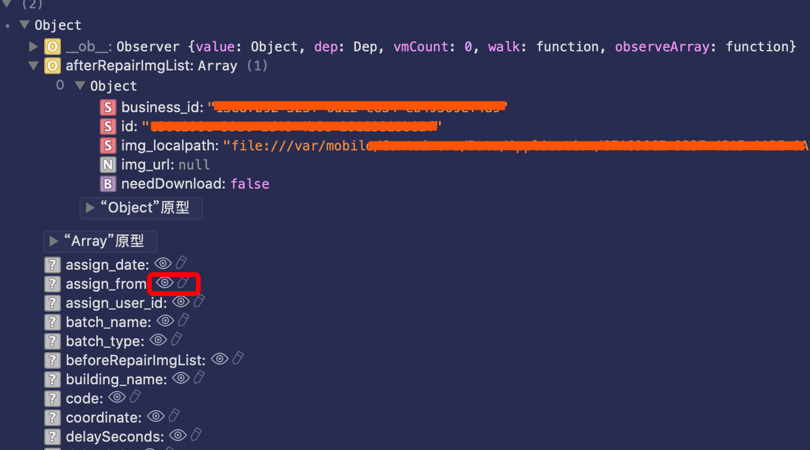

## 背景

**大家在写 vue 组件的过程中，有没有遇到过这种状况：相似的两个组件开发，有个组件数据操作变更的时候页面能够及时响应变更，另一个却不行**

最近在做重构任务的过程中，我就遇到了这种问题，如下图，一个 vue 组件:

 

预期的效果是，点击`点击下载`按钮，图片变成加载状态也就是转菊花^\_^。很简单吧？作为一个搬砖多年的前端，这种效果已经不知道实现多少遍了。但是这次却翻车了。

咱们看下代码：

```html
<!--ui组件，-->
...
<ul>
  <li
    v-for="(img, index) in baseInfo.afterRepairImgList"
    :key="index"
    @click="browerImages(baseInfo.afterRepairImgList, index)"
  >
    
    <a v-if="img.needDownload" class="click-download">点击下载</a>
  </li>
</ul>
...
```

```js
// data 数据绑定
data(){
  return {
    baseInfo:{
      afterRepairImgList:[]
    }
  }
}
// 获取数据
getDetail(problem_id, status) {
  return ProblemService.getProblemDetail(problem_id)
  .then(data => {
    this.baseInfo = data.base_info || {};
    // 整改后照片（最多只能有三张图片）
    var afterRepairImgList = [];
    data.afterRepairimglist.forEach(function(v, k) {
      afterRepairImgList.push(v);
    });
    this.fixImgList = data.base_info.afterRepairImgList = afterRepairImgList.slice(0, 3);
  })
}
// 点击操作
browerImages(imageList, index) {
  ...

  var img = imageList[index];
  if (img && img.needDownload) {
    img.needDownload = false;
    // 如果需要手动下载，就显示菊花。问题就出自这里，数据（img.img_localpath）确实变了，但是页面并未刷新
    img.img_localpath = require('@assets/images/common/loading-3.gif');
    ProblemService.downloadProblemImage(img).then(function(imgPath) {
      img.img_localpath = imgPath;
    });
  }

  ...
}
```

上面的代码逻辑并不复杂，我们需要渲染的数据是`data.baseInfo.afterRepairImgList`，一个数组，其中控制菊花显示的是`afterRepairImgList[x].needDownload`属性。理论上讲，如果`afterRepairImgList`能够正常绑定到 vue 的数据响应式系统。那么我们调用`browerImages()`是能够正常显示加载状态的。但事实是出现了 bug。

## 解决方案

我们先说下遇到这种问题一些常用的解决方案：

1. 用`$forceUpdate`，这种方案不用多说，会强制刷新当前组件。就是要注意一点别在`update`这个生命周期使用就行，不然会进入回调地狱。

2. 使用`flag`，这算是一种讨巧的方式，我们可以组件的根元素上面随便绑定一个属性，然后把该属性值放在`data`下，最后在 data change 的地方去触发这个 flag 变化，从而达到组件强制更新的目的。比如：

```html
<ul :flag="flag">
  <li
    v-for="(img, index) in baseInfo.afterRepairImgList"
    :key="index"
    @click="browerImages(baseInfo.afterRepairImgList, index)"
  >
    
    <a v-if="img.needDownload" class="click-download">点击下载</a>
  </li>
</ul>
```

```js
data(){
  return {
    flag:true,
    baseInfo:{
      afterRepairImgList:[] // 确保afterRepairImgList能够被绑定上
    }
  }
}
...


browerImages(imageList, index) {
  ...
  img.needDownload = false;
  // 变更flag， 强制触发组件更新
  this.flag = !this.flag;
  ...
}
```

3. 前面两种方式用起来快。但是总感觉过于粗暴，而且治标不治本。作为一个精益求精的 coder，我们应该寻求更加清晰且一劳永逸的方法。于是就有了下面的心路历程

## 方案三分析

**追根溯源，产生问题的根本原因是什么？**
实际上原因就是我上面有提到的`afterRepairImgList[x].needDownload`没有被绑定到数据响应式系统。
**顺便问大家一句，你如何用最快的速度去判断一个属性有没有被绑定？**
这个第一反应一般都是用 chrome 插件：[vue devtools](https://github.com/vuejs/vue-devtools)
其实有个超级简单的方式：直接用`console.log`，浏览器已经帮我们做好标记了，我们打印一下试试：



如图，只要是后面带小眼睛图标的都是被绑定监听的，且只有点击才触发。可以看到`needDownload`没有被监听到。其实这个 console.log 包含的信息远不止这些，比如属性我们平时学 vue 原理常见的 Observer、Dep、Watcher 等都有体现。这更加方便我们在实践中理解 vue 的基本原理。

ok, 回归正题，基于以上我们作几个猜想，来分析问题原因。

**猜想 1:** 难道是因为数据过于复杂，对象嵌套数组，数组里面又有对象，如此反复，导致`needDownload`不能被 watch ？

针对这点我们可以做个实验:

```js
// 我们写一个5层嵌套的复杂对象
data () => ({
  dataInfo: {
    id: '000-000-000',
    list: [
      {
        id: '111',
        list: [
          {
            id: '111-222',
            list: [{ id: '111-222-333', list: [{ id: '111-222-333-444' }] }],
          },
        ],
      },
      {
        id: '222',
        list: [
          {
            id: '222-222',
            list: [{ id: '222-222-333', list: [{ id: '222-222-333-444' }] }],
          },
        ],
      },
    ],
  },
})
...
changeThis(item) {
  item.id = item.id
    .split("-")
    .map(v => {
      return v - 1;
    })
    .join("-");
},
```

然后渲染出来，点击末端按钮，然后按钮的名字会变化。

```html
<ul>
  <li v-for="(item, index) in dataInfo.list" :key="index">
    <p>{{ item.id }}</p>
    <ul>
      <li v-for="(i, idx) in item.list" :key="idx">
        <p>{{ i.id }}</p>
        <ul>
          <li v-for="(r, idr) in i.list" :key="idr">
            <p>{{ r.id }}</p>
            <ul>
              <li v-for="(o, ido) in r.list" :key="ido">
                <button @click="changeThis(o)">{{ o.id }}</button>
              </li>
            </ul>
          </li>
        </ul>
      </li>
    </ul>
  </li>
</ul>
```

初始化为左图，渲染为右图


可以看到一切正常，猜想 1 不成立。其实 vue 的数据响应机制绑定数据的规则是，对复杂对象或者数组进行递归，类似与 deepClone 算法，**遇到**属性就进行劫持加 watch 等一系列操作。所以理论上讲，不管你对象结构有多复杂，vue 都能给你绑定上。数据的复杂度毫无影响。

**猜想 2:** 数组的一些常规操作例如：`pop, push, shift`等会导致数组无法被劫持监听？

实际上这个也是不成立了，vue 源码里面明确对这些变异方法 (mutation method)做了重写：包括 7 种`push,pop,shift,unshift,splice,sort,reverse`。使得这些方法调用时候不影响劫持监听。

能影响数组劫持监听的就两种情况：

1.当你利用索引直接设置一个项时，例如：vm.items[index] = newValue

2.当你修改数组的长度时，例如：vm.items.length = newLength

检查下代码，没有这两种操作，猜想 2 排除。

**猜想 3：**给对象新增属性会导致新增属性无法被监听劫持，是这个吗？

这也是我能想到的最后一种可能影响，也是概率最大的。我们再会看一下代码，在最开始我们直接在 data 上就绑定好了`afterRepairImgList`，但是最后他并没有被劫持，只有可能他的父级直接被重写了，果然，我们看到了这段代码：

```js
return ProblemService.getProblemDetail(problem_id).then(data => {
  // 这里直接赋值了
  this.baseInfo = data.base_info || {}

  var afterRepairImgList = []
  data.afterRepairimglist.forEach(function(v, k) {
    afterRepairImgList.push(v)
  })
  // 虽然这里又重新给baseInfo.afterRepairImgList赋值了，但这算是新增属性
  this.fixImgList = data.base_info.afterRepairImgList = afterRepairImgList.slice(
    0,
    3
  )
})
```

由于 data.base_info 里面没有 afterRepairimglist 这个属性，所以后面的代码属于新增属性操作。但是还有一点疑问： `data.base_info` 不是对象吗？它是引用类型啊，我在后面赋值对他应该没有影响才对啊？ 实际上这是一个理解误区，混淆了劫持和代码执行的概念。vue 的劫持是在赋值那一瞬间执行的，真实的情况应该是这样：

```js
//1
this.baseInfo = data.base_info || {}
//2. vue源码开始运作，进行一系列劫持监听操作

//3
data.base_info.afterRepairImgList = afterRepairImgList.slice(0, 3)
```

我们把`this.baseInfo = data.base_info || {}`这段代码放在最后，果然 bugfree

## 总结

以上可以看出，这个问题的原因很简单，解决方式也很简单：**只要是涉及到的 data 属性结构相对复杂，那么他们的赋值操作就尽量放在函数内的最下面**。相信我，这个习惯会解决 90%类似的问题。

往往简单的东西最容易被忽略。vue 数据劫持的原理大家都清楚，但有时候真遇到类似问题却很少第一时间按照原理逐步分析，抽丝剥茧，因为实践中经常因为数据太复杂或者业务逻辑嵌套过深而忽略这方面的思考。

还有一点，这个图也容易给人造成误解, 以为 data 下的属性只会劫持一次


应该加条线，如下：


最后的最后，给大家出个小问题，如图，这种情况是怎么形成的？


